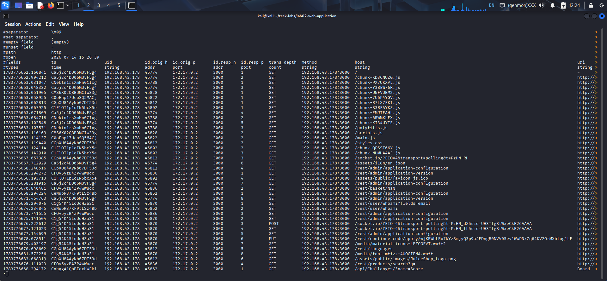
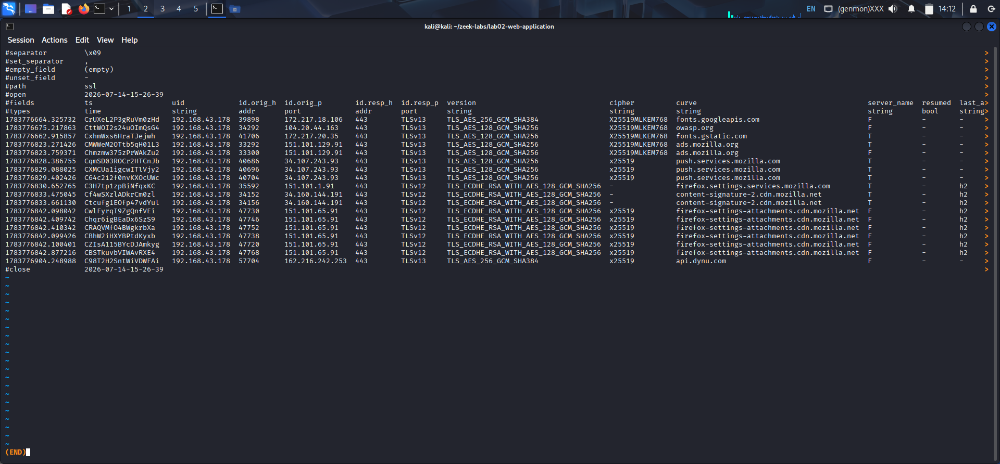

# Lab 02 – Web Application Traffic Investigation

## Objective

Analyze network traffic generated while interacting with the OWASP Juice Shop web application using Zeek. The goal is to understand how normal web browsing activity appears across different Zeek logs and correlate evidence between HTTP, DNS, SSL/TLS, QUIC, and Files logs.

---

## Lab Environment

- **Operating System:** Kali Linux
- **Target Application:** OWASP Juice Shop
- **Analysis Tool:** Zeek
- **Capture File:** `lab02-web-application.pcapng`

---

## Zeek Logs Analyzed

- conn.log
- http.log
- dns.log
- ssl.log
- quic.log
- files.log

---

## Key Findings

- Identified HTTP requests for web pages, JavaScript bundles, stylesheets, fonts, images, and REST API endpoints.
- Correlated DNS lookups with HTTP and encrypted TLS connections.
- Observed secure TLS 1.2 and TLS 1.3 sessions.
- Identified one HTTP/3 (QUIC) connection to Google Fonts.
- Confirmed normal browser interaction with the Juice Shop application.

---

## Screenshots

### HTTP Request Analysis



### SSL/TLS Analysis



---

## Project Structure

```text
lab02-web-application/
├── README.md
├── lab02-web-application.pcapng
├── notes/
│   └── investigation.md
├── screenshots/
│   ├── 01-http-request-sequence.png
│   └── 02-ssl-log-analysis.png
└── zeek-logs/
```

## Skills Demonstrated

- Network Traffic Analysis
- Zeek Log Analysis
- HTTP Investigation
- DNS Analysis
- TLS/SSL Analysis
- QUIC Analysis
- Evidence Correlation
- Cybersecurity Documentation
